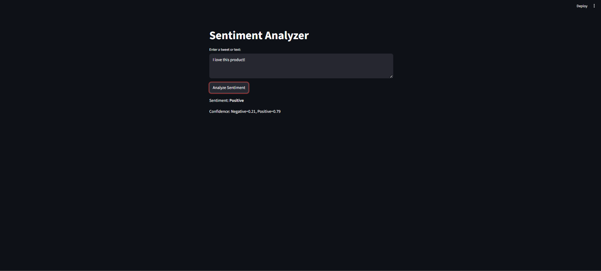

# 📝 Sentiment Analysis Tool (BERT + Logistic Regression)

🚀 A Machine Learning project that classifies text into **Positive, Negative, or Neutral sentiments** using NLP techniques.

---

## 📌 Features
- 🔍 Text sentiment classification  
- 🤖 BERT embeddings + Logistic Regression  
- 📊 Works on real-world text data  
- ⚡ Fast prediction  

---

## 🧠 Tech Stack
- Python 🐍  
- Scikit-learn  
- Transformers (BERT)  
- Pandas, NumPy

---

## 📸 Demo



<p align="center">
  
</p>

---

## ▶️ How to Run

```bash
git clone https://github.com/Ak21218/YOUR-REPO-NAME.git
cd YOUR-REPO-NAME
pip install -r requirements.txt
python app.py
## 📂 Project Structure
sentiment-analysis/
│
├── data/
├── model/
├── app.py
├── requirements.txt
├── README.md

---

# Sentiment Analysis with BERT and Logistic Regression

This project implements a sentiment analysis classifier using BERT (Bidirectional Encoder Representations from Transformers) embeddings combined with Logistic Regression. The model is trained on the Sentiment140 dataset and deployed as a Streamlit web application for real-time sentiment prediction.

## Features

- **Data Preprocessing**: Cleans and preprocesses the Sentiment140 dataset, including text cleaning, stopword removal, and sentiment label mapping
- **BERT Embeddings**: Generates contextual embeddings using the pre-trained BERT-base-uncased model
- **Model Training**: Trains a Logistic Regression classifier on BERT embeddings for binary sentiment classification (positive/negative)
- **Web Application**: Interactive Streamlit app for real-time sentiment prediction on user-input text
- **Pseudo-Labeling**: Implements semi-supervised learning techniques to expand the training dataset
- **Visualization**: Performance metrics and model evaluation visualizations
- **Balanced Dataset Creation**: Creates a balanced subset of the Sentiment140 data for improved model training

## Project Structure

```

## Installation

1. Clone this repository:
   ```bash
   git clone <repository-url>
   cd sentiment-analysis-bert
   ```

2. Install the required dependencies:
   ```bash
   pip install -r requirements.txt
   ```

   Required packages:
   - streamlit
   - transformers
   - torch
   - scikit-learn
   - pandas
   - numpy
   - nltk
   - joblib

3. Download NLTK stopwords:
   ```python
   import nltk
   nltk.download('stopwords')
   ```

## Usage

### Data Preparation

1. **Preprocess the Sentiment140 dataset**:
   ```bash
   python preprocess_sentiment140.py
   ```

2. **Create a balanced subset** (optional, for faster training):
   ```bash
   python create_balanced_subset.py
   ```

3. **Generate BERT embeddings**:
   ```bash
   python bert_embeddings.py
   ```

### Model Training

Train the Logistic Regression model on BERT embeddings:
```bash
python train_sentiment_model.py
```

### Web Application

Run the Streamlit web application for sentiment prediction:
```bash
streamlit run app.py
```

Open your browser and navigate to the provided local URL to interact with the sentiment classifier.

### Pseudo-Labeling (Optional)

Expand the training dataset using pseudo-labeling:
```bash
python pseudo_labeling_tweets.py
```

### Visualization

Visualize model performance metrics:
```bash
python visualize_performance.py
```

## Model Architecture

1. **Input Processing**: Text is tokenized and encoded using BERT tokenizer
2. **Embedding Generation**: BERT-base-uncased model generates 768-dimensional embeddings
3. **Classification**: Logistic Regression classifier predicts sentiment (0: Negative, 1: Positive)

## Dataset

The project uses the Sentiment140 dataset, which contains 1.6 million tweets labeled for sentiment. The dataset is preprocessed to:
- Remove URLs, mentions, and hashtags
- Convert to lowercase
- Remove punctuation and stopwords
- Map sentiment labels (0: Negative, 4: Positive → 0: Negative, 1: Positive)

## Performance

The model achieves competitive performance on the Sentiment140 test set. Performance metrics are displayed during training and can be visualized using the provided visualization script.

## Contributing

Contributions are welcome! Please feel free to submit a Pull Request.

## License

This project is licensed under the MIT License - see the LICENSE file for details.
